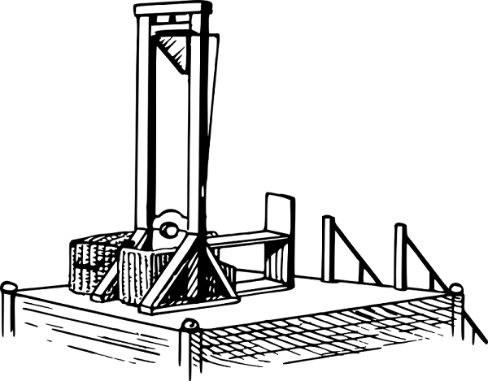

## I'm not saying take your CMS to the guillotines, I'm saying make your CMS accessible for all-sorts of software

### What kind of CMS do I have now?

WordPress powers 38% of the internet, and is 63% of all CMS' are WordPress. If you are using WordPress, then you are using a traditional CMS. The same can be said if you are using Drupal or Joomla. If you aren't using one of these CMS', please shoot me an email or fill on the form on the homepage. I'd love to learn about what you are using! 

**Okay, I'm using a traditional CMS good. I don't know what that is...**

A traditional CMS (content management system) is a tool used to store content like web pages, blog posts, images, and videos, in a database and make them easily accessible. Content Management Systems make web page building easy for people who don't know how to code. That's cool, though; the web is for everyone, not just the developers. A CMS like WordPress is so widely popular that they make websites easy to publish and develop for everyone. I started my career solely developing WordPress, and I am still a massive fan of it after 10+ years in the web development business.

I learned what the CMS is good at and what it's not good at throughout the years. I even wrote a blog article on the topic ["Use WordPress For What It Is Best At"](/use-wordpress-for-what-it-is-best-at/). The main thing I am concerned about with the state of WordPress is that it is falling behind in browser performance. I spent countless hours trying to optimize the WordPress site's frontend to get good scores on [GTMetrix](https://gtmetrix.com) and [Google PageSpeed Insights](https://developers.google.com/speed/pagespeed/insights/), and it was a painful experience. I looked to JS libraries like React to help me. If I built out a React.js website and then pulled content using WP-Rest API, I could decouple WordPress from the front end and solve my issues. 

Decoupling WordPress's frontend did help. Having it built out using a Create React App tool gave me more control over the scripts and stylesheets of the site.  When I ran the site through GTMetrix and Google Page Speed, the metrix did improve. But, there, having a React.js frontend did solve all my performance issues.  I needed to set up server configs to ensure that the server was sending up cached and minimized resources. There were a handful of plugins that claimed they'd take care of them for me, and after hours of trial and error, none of them worked. 

The only solution that made sense was the set up a custom hosting server. I picked Digital Ocean with Ubuntu and used Ngnix as the webserver. This server hosted my WordPress installation with my custom React.js theme. I was able to set up caching for resources and configured Nginx to allow some other low-level configs. However, my scores improved slightly, and I felt like I was very much out of my comfort zone and pulling in random code-snippets for docs. Through that experience, I learned that I like to push myself outside of my comfort zone. However, I also automatically mentally regulate the time and level of management of these new areas if I implement them professionally. Basically, I couldn't handle frontend development, backend development, and DevOps by myself.

That's when the JAMstack became my light at the end of the tunnel. JAMstack is all the rage for the developer community, but what business owners need to know is that you can do more with less, [very good for your digital presence](/we-are-a-jamstack-shop). Moving the site from WordPress with React.js to the JAMstack, solved all my problems.  I migrated my React.js theme to Next.js and published it on separate hosting using Vercel. Next.js is a React.js framework that [enables functionality such as server-side rendering and generating static websites](https://nextjs.org). And, Vercel is the company behind Next.js, and they offer free hosting for Next.js applications. Their hosting platform is designed for performance handing all the webserver configs I was stretching myself trying to manage. 

Now the front end of my website is a new application designed for performance 100% outside of WordPress, and the metrix is through the roof. I still had my WordPress set up to manage content, but now it would be considered headless. I only used WordPress to store and manage data and serve it over WP-Rest API. That approach is known as going headless with WordPress, meaning there isn't a front end part to the system.  Through this process, I learned that there are tools that can do everything but only do a small number of things better than others when it comes to the web. 

### What kind of CMS should I have? 

If your company has the same issues with your website as I did, I would recommend going headless with your WordPress site. However, if you are starting from scratch and want the same, a CMS backend and a performant frontend, there are plenty of CMS designed to be headless out of the box. I haven't had an opportunity to build a website with it yet, but I'm excited to try out [Sanity.io](https://sanity.io). Sanity.io is a headless CMS where you build out fields to store the data. It's not like WordPress, where there are posts and pages. With Sanity.io, there is a blank slate you decide how the content will be organized and stored. 

A couple of other headless CMSs I'd be open to checking are [Netlify CMS](https://www.netlifycms.org/) because I love everything from this company, Contentful, Butter CMS, and Directus.

### How can I go headless?

If you got to this point of the blog post, you are well aware I am very capable of migrating a monolithic website to using a headless CMS and the JAMstack architecture. 

